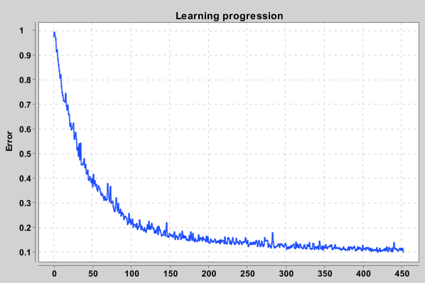

# SuperSimpleNet - Simple Nerual Network Implementation

[](https://github.com/KlemenDEV/SuperSimpleNet/blob/master/LICENSE)

SuperSimpleNet is a simple nerual network implementation for educational use and simple classification use cases
written in Java. It tries to use parallelization as much as possible to use all available CPU cores for
faster processing.

This repository includes use examples in form of Unit tests. There are two examples:
* XOR implementation using SimpleNet
* Classification of samples from ISOLET dataset

## Learning curve for ISOLET dataset



```
Properly classified (mAP): 98.58929143956397 % of training samples
Properly classified (mAP): 95.25336754329699 % of test samples
```

# Getting started

Check unit tests for usage examples. You can run them by running test Gradle task.
